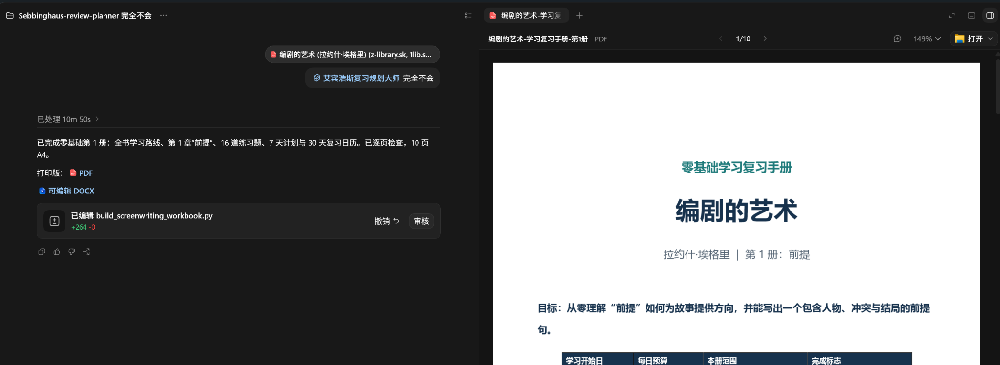

# 艾宾浩斯复习计划表

`ebbinghaus-review-planner` 是一个面向 ChatGPT / Codex 的学习与复习规划 Skill。它会把用户明确想学习、记忆、复习、备考或长期掌握的书籍、PDF、课程讲义、教材和培训资料，整理成零基础教学卡、知识地图、主动回忆题、自适应复习日期、每日唯一任务，以及经过内容和页面审核的 A4 学习手册。

当前版本：`1.4.0`

## 示例效果

下面是使用真实书籍测试时的对话与生成文件预览：



## 这个仓库是什么

这是「艾宾浩斯复习计划表」Skill 的 GitHub 一键安装仓库。

仓库根目录提供项目介绍、安装方式、示例和版本信息；内层 `ebbinghaus-review-planner/` 是真正可被 Skills 工具识别和安装的完整 Skill 文件夹。

## 适合谁用

- 零基础学习者：面对一本书或教材完全不会，希望从最基础的解释和例子开始。
- 学生与考证人群：把课程、讲义和考试资料变成每天能执行的复习计划。
- 职场学习者：学习产品知识、企业制度、SOP、销售话术和专业资料。
- 阅读与研究者：把书籍、论文和长文整理成知识地图与主动回忆练习。
- 培训负责人：制作可打印、可编辑、可检测的学习手册。

## 会产出什么

Skill 会生成一套完整学习系统：

- **范围覆盖表**：明确哪些内容精读、略读、选读或暂不学习。
- **零基础教学卡**：大白话解释、正例、反例、步骤拆解、引导练习、独立练习和迁移应用。
- **知识地图**：用 K001、K002 等编号管理知识点，并与 Q001 等练习题对应。
- **主动回忆题**：通过填空、纠错、复述、应用等方式检测是否真正掌握。
- **每日唯一任务**：把新学、R0、到期复习、应用和纠错合并到一条任务中。
- **0—4 分自评**：逐题记录掌握状态，并计算下一次复习日期。
- **A4 学习手册**：同时交付可编辑 DOCX 和可打印 PDF。

## v1.4.0 核心升级

这次升级来自真实教材测试，重点解决成品交付问题：

- DOCX 作为唯一母版，PDF 必须从最终审核后的同一份 DOCX 直接转换。
- 避免 Word 和 PDF 内容、页数、字号和版式不一致。
- 自动检查连续分页符、意外空白页、标题样式、动态页码和过小字号。
- 普通正文不得小于 10 磅，表格和答案正文不得小于 9.5 磅。
- 禁止拆断英文单词、K/Q 编号、题号范围和日期。
- 零基础模式下，所有 A 级知识点必须先有教学卡，再进入正式测试。
- 首页解释 `K = Knowledge`、`Q = Question`，不再假设用户理解内部编号。
- 正式评分以每道题为单位，每日任务表只记录「当日最低分」。
- 自适应间隔统一向上取整到整数天。
- R0 明确为：学习后等待约 20 分钟，再做 3—5 分钟闭卷回忆。
- 新增 DOCX/PDF 文本一致性检查，默认正文覆盖率至少 97%。

## 一键安装

```bash
npx skills add https://github.com/yxxx6666/ebbinghaus-review-planner --skill ebbinghaus-review-planner
```

## 怎么用

安装后，在 ChatGPT / Codex 中调用：

```text
$ebbinghaus-review-planner

我完全不会这份资料，请从零开始教我。
每天可以学习 30 分钟。
请生成零基础教学卡、知识地图、主动回忆题、每日复习任务，
并制作成 A4 Word 和 PDF 学习手册。
```

考试冲刺场景：

```text
$ebbinghaus-review-planner

我 20 天后考试，每天可以学习 40 分钟。
请根据这份讲义生成每天唯一的学习任务和复习计划。
```

复习后反馈：

```text
Q001：3分
Q002：1分
Q003：4分

请更新这些题目的下一次复习日期。
```

评分标准：

| 分数 | 掌握状态 |
|---|---|
| 0 | 完全不会 |
| 1 | 模糊，需要明显提示 |
| 2 | 能答出主要内容，但不稳定 |
| 3 | 能独立、准确、完整讲解 |
| 4 | 能在新场景中实际应用 |

## 工作流程

1. 判断资料类型、学习目标、基础水平、开始日和每日预算。
2. 建立本册范围覆盖表，避免无说明跳页。
3. 建立知识地图并标记 A/B/C/D 级。
4. 零基础模式先为所有 A 级知识点生成教学卡。
5. 生成主动回忆题，并建立 K 与 Q 的对应关系。
6. 把新学、R0、复习、应用和纠错合并成每日唯一任务。
7. 根据逐题 0—4 分计算下一次复习日期。
8. 生成 A4 DOCX 唯一母版并逐页审核。
9. 从最终 DOCX 直接转换 PDF。
10. 分别检查 DOCX、PDF，并验证双格式内容一致性。

## 质量检查脚本

```bash
python ebbinghaus-review-planner/scripts/quick_validate.py ebbinghaus-review-planner
python ebbinghaus-review-planner/scripts/check_docx_workbook.py output.docx --require-headings --require-page-numbers
python ebbinghaus-review-planner/scripts/check_a4_pdf.py output.pdf --require-page-numbers
python ebbinghaus-review-planner/scripts/check_output_pair.py output.docx output.pdf --min-coverage 0.97
```

## 目录结构

```text
ebbinghaus-review-planner/
├── README.md
├── LICENSE
├── .gitignore
├── docs/
│   └── docs/example-output-chat-and.jpg
└── ebbinghaus-review-planner/
    ├── SKILL.md
    ├── README.md
    ├── CHANGELOG.md
    ├── VERSION.md
    ├── RELEASE_REPORT.md
    ├── agents/
    ├── examples/
    ├── references/
    └── scripts/
```

## 版本信息

- Skill ID：`ebbinghaus-review-planner`
- 中文显示名：`艾宾浩斯复习计划表`
- 当前版本：`1.4.0`
- Release tag：`v1.4.0`
- 入口文件：`ebbinghaus-review-planner/SKILL.md`

## License

MIT
